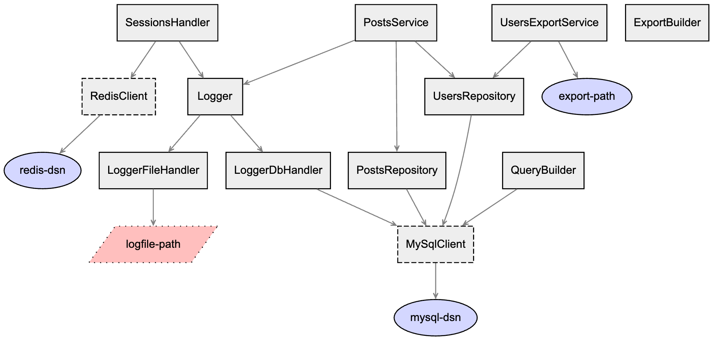

# Dependency Injection Container

For those who understand what it is and strive for simplicity.

Zero dependencies and PHP 7.1+.

## Features
* Simple API: Container API is as simple as regular array.
* Tags: Organize services using tags and fetch them in groups (consider them aliases).
* Shared Instances: Easily create singletons with a built-in helper.
* Service Extenders: Modify/Extend services after creation and before they are fully resolved.
* Circular Dependency Detection: Automatically prevents and reports circular dependencies.
* Autowiring: Container will automatically resolve dependencies.
* Rewrite Protection: Reports about accidental service rewrite.
* Service Providers: Package your services into a provider for better organization.
* Symlinks: Runtime hot-swap.
* Graph: Generate DOT script to visualize dependencies (Graphviz).

### Simple API
Consider `Container` as a regular array.
```php
$container = new Container();

$container['cache-file-path'] = '/tmp/app.cache';
$container[CacheStorage::class] = fn (Container $c) => new CacheStorage($c['cache-file-path']);
$container[Cache::class] = fn(Container $c) => new Cache($c[CacheStorage::class]);

$cache = $container[Cache::class];

$cache->get('currency-rates');
```
Easier than ever for simple script/app.

### Tags
Things get a bit more complicated when you need tags. Use the `Container::add()` method to setup tags.
```php
$container = new Container();

$container['log-file-path'] = 'your.log';
$container->add('file-handler', fn (Container $c) => new StreamHandler($c['log-file-path']), ['handler']);
$container->add('stdout-handler', fn (Container $c) => new StreamHandler('php://output'), ['handler']);
$container[Logger::class] = function (Container $c) {
    $logger = new Logger('app');
    $logger->setHandlers($c->getByTag('handler'));

    return $logger;
};


$logger = $container[Logger::class];

$logger->warning('Oops!');
```
Use the `Container::getByTag()` method to retrieve services by tags.
This separate method exists because regular `get` should return a specific service or throw a `NotFoundException` 
exception.

Clear and strict separation: `Container::get()` returns a service or throws `NotFoundException`, 
and the `Container::getByTag()` returns an array of services of throws `NotFoundException`.

#### Alias
This container has no separate feature like `alias` for two main reasons.
* Container has a `tags` feature, basically `alias`.
* To keep container code as simple as possible.

Use tagging functionality to achieve the same `$service = $container->getByTag('tag')[0];`.
Don't worry about `Warning: Undefined array key 0` because container does not return an empty array. It will return 
an array of services or throw `NotFoundException` like regular `get`.

Most likely, you want to use `alias` to avoid class name exposure. For example when you want to get service 
by requests param.
```php
class GameController extends Controller {
    public function getPotion(string $potionType)
    {
        try {
            $potionService = $this->container->getByTag($potionType)[0];

            return new Response($potionService->getPotion());
        } catch (NotFoundException) {
            return new Response('Unknown potion type: ' . $potionType, 400);
        } catch (Exception $exception) {
            $this->logger->error($exception->getMessage());
            return new Response('Sorry, internal error', 500);
        }
    }
}
```

### Shared Instances
Use `Container::addShared()` method to create a shareable service. 
Container will return the same instance each time.
```php
$container = new Container();

$container->addShared(MySQLConnection::class, fn (Container $c) => new MySQLConnection());

$conn1 = $container->get(MySQLConnection::class);
$conn2 = $container->get(MySQLConnection::class);

assert(spl_object_hash($conn1) === spl_object_hash($conn2));
```

### Service Extenders
Use `Container::extend()` to modify services by a common parent.
```php
$container = new Container();
$container[\Logger::class] = fn () => new \Logger();
$container[\SomeRepository::class] = fn () => new \SomeRepository();
$container->extend(\BaseRepository::class, function (\BaseRepository $repository, Container $c) {
    $repository->setLogger($c[\Logger::class]);

    return $repository;
});

$repository = $container[\SomeRepository::class];
// From now on, every repository returned by the container and which `extends` BaseRepository has a Logger inside.
```

### Circular Dependency Detection
Container will let you know if you have a circular dependency.
```php
$container = new Container();
$container[A::class] = fn (Container $c) => new \A($c[B::class]);
$container[B::class] = fn (Container $c) => new \B($c[A::class]);

$a = $container[\A::class];
// CircularDependencyException: Circular dependency detected: A -> B -> A 
```

### Autowiring
Use `AutowireContainer` for automatic dependency resolving.
```php
class FilesystemAdapter {
    // some logic inside
}
class Filesystem {
    /**
     * @var \FilesystemAdapter
     */
    private $adapter;

    public function __construct(FilesystemAdapter $adapter)
    {
        $this->adapter = $adapter;
    }
    
    // use $this->adapter as you need
}

$container = new AutowireContainer();

$filesystem = $container[Filesystem::class]
// $filesystem will be an instance of Filesystem that contains FilesystemAdapter inside
```

### Rewrite Protection
Container will throw an exception if you accidentally rewrite the service definition.
```php
$container = new Container();
$container['k'] = 'v1';
$container['k'] = 'v2'; // RewriteAttemptException: The resource 'k' already defined.
```
> _But what if I need to overwrite definition!_

Shift your mindset from "overwrite" to "setup based on X condition" and do it in the user-land code.
```php
$container = new Container();
$container['mysql-dsn'] = getenv('ENVIRONMENT') === 'prod' ? 'mysql://production-dsn' : 'mysql://development-dsn';
```
This approach, together with `Rewrite Protection,` will keep your code strict and more understandable.
There will be no hidden overwrites.

### Service Providers
Providers give you the benefit of organizing your definitions.
```php
class LoggerServiceProvider implements ProviderInterface {
    public function register(Container $container): void
    {
        // Define your handlers, formatters, processors, and logger itself.
        // All Logger-related things are in one place.
    }
}
```
Then, add the provider to the container.
```php
$container->addProvider(new LoggerServiceProvider());
```

### Symlinks
You can create symlinks that allow you to get different services on the run, without changing user-land code.
```php
$container = new Container();
$container->add(MasterMySqlClient::class, fn (Container $c) => new MasterMySqlClient($c['mysql-dsn']));
$container->add(SlaveMySqlClient::class, fn (Container $c) => new SlaveMySqlClient($c['mysql-dsn']));

$container->symlink(MasterMySqlClient::class, MySqlInterface::class);
$container->get(MySqlInterface::class); // MasterMySqlClient

$container->symlink(SlaveMySqlClient::class, MySqlInterface::class);
$container->get(MySqlInterface::class); // SlaveMySqlClient
```
**Note:** Only one symlink to a specific service can exist at a time.

### Graph
Using the DOT language, build a graph (as in nodes and edges, not as in bar charts). **Note:** Graph not working 
with `AutowireContainer`.
```php
$container = new Container();
// Add services and define dependencies

$graph = new Graphviz($container);
$graph->build();
```
For example, you can visualize the output of `Graphviz::build()` with https://dreampuf.github.io/GraphvizOnline.

Graph element explanation:
* Oval — parameter
* Solid Rectangle — service
* Dashed Rectangle — shared service
* Parallelogram — non-existent service or param



## PSR-11
Install `psr/container` package first.
```bash
composer require psr/container
```

Then wrap `Container` in `PsrContainer` and pass it to whoever expected `Psr\Container\ContainerInterface`.
```php
// Define services, dependencies, etc.
$container = new Container();

// Wrap it.
$psrContainer = new PsrContainer($container);

$service = $psrContainer->get(Service::class);
```
